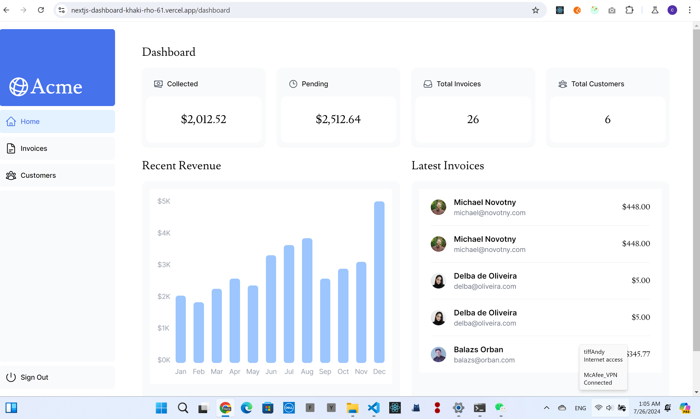
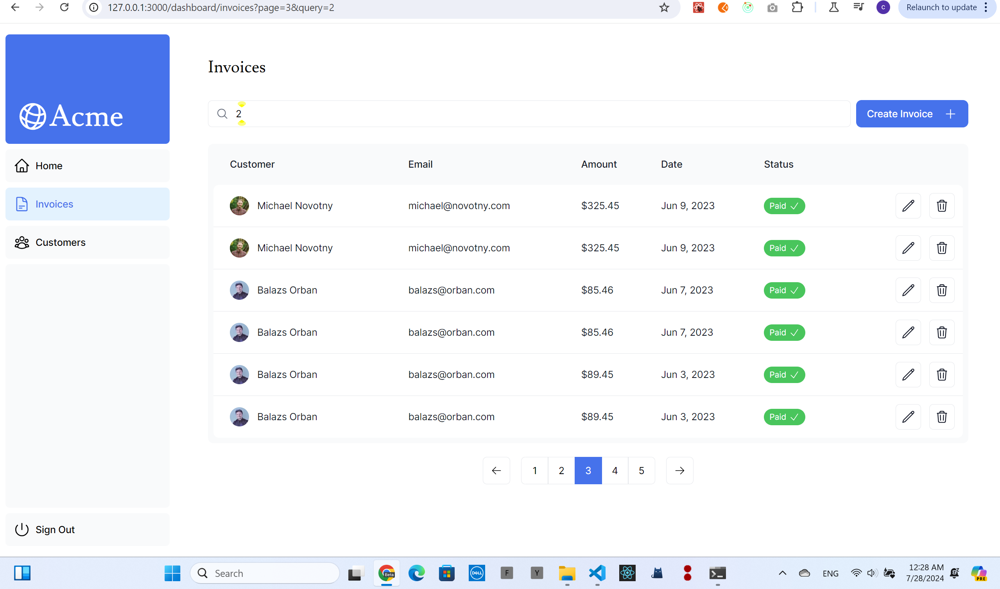
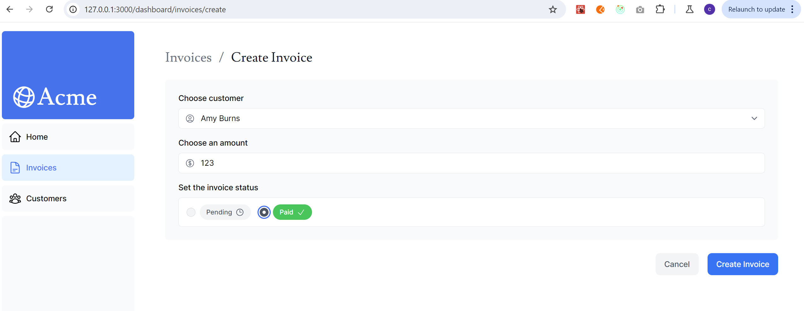

# deployment
## dashboard

## invoices

## invoice create

## next.auth
```
pnpm i next-auth@beta
openssl rand -base64 32
```

## Next.js App Router- Starter

This is the starter template for the Next.js App Router Course. It contains the starting code for the dashboard application.

For more information, see the [course curriculum](https://nextjs.org/learn) on the Next.js Website.
